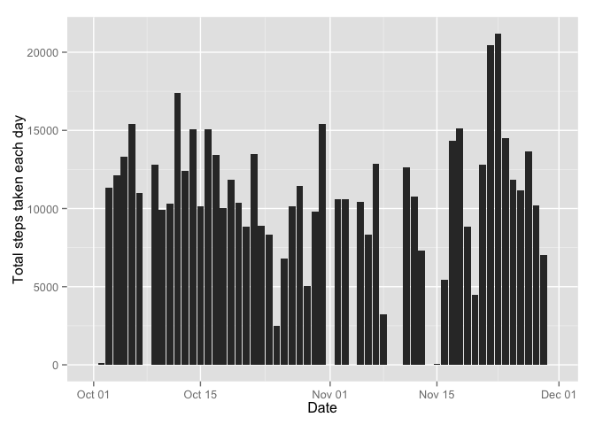
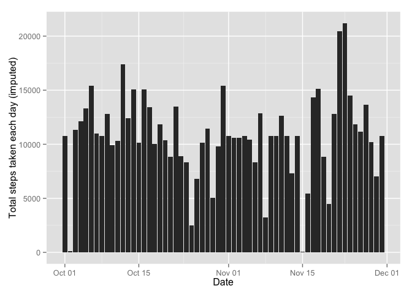
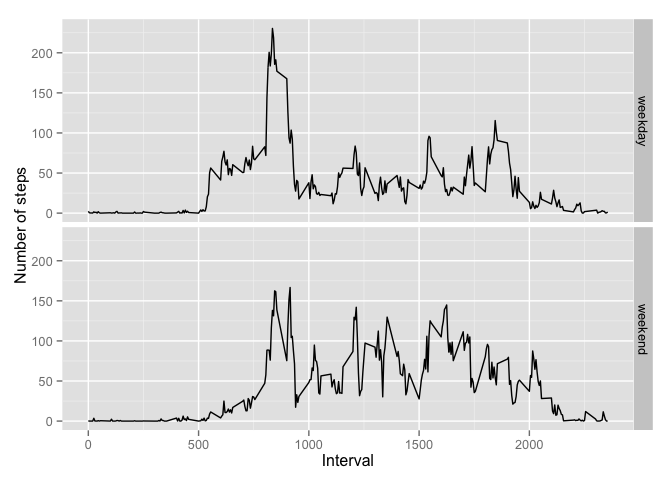

# Reproducible Research: Peer Assessment 1

#Reproducible Research: Peer Assessment 1


## Loading and preprocessing the data

Data loading and processing: 

1. Unzip folder and save the data to /data folder
2. Read data into data frame
3. Check the structure of data with summary
4. Convert the data into tbl_df format 


```r
 Sys.setlocale("LC_TIME", "C") #To ensure that weekdays are in English in the last assignment
library(dplyr)
library(ggplot2)
```


```r
#unzip the data folder
unzip(zipfile = "activity.zip", exdir = "./data")
#read data into dataframe
activity <- read.csv("./data/activity.csv")
#review structure of data with summary()
summary(activity)
```

```
##      steps               date          interval   
##  Min.   :  0.0   2012-10-01:  288   Min.   :   0  
##  1st Qu.:  0.0   2012-10-02:  288   1st Qu.: 589  
##  Median :  0.0   2012-10-03:  288   Median :1178  
##  Mean   : 37.4   2012-10-04:  288   Mean   :1178  
##  3rd Qu.: 12.0   2012-10-05:  288   3rd Qu.:1766  
##  Max.   :806.0   2012-10-06:  288   Max.   :2355  
##  NA's   :2304    (Other)   :15840
```

```r
str(activity)
```

```
## 'data.frame':	17568 obs. of  3 variables:
##  $ steps   : int  NA NA NA NA NA NA NA NA NA NA ...
##  $ date    : Factor w/ 61 levels "2012-10-01","2012-10-02",..: 1 1 1 1 1 1 1 1 1 1 ...
##  $ interval: int  0 5 10 15 20 25 30 35 40 45 ...
```

```r
activity$date <- as.Date(activity$date)
activity <- tbl_df(activity)

#Calculate total number of steps taken in one day

total_steps <- activity %>% 
  group_by(date) %>% 
  summarise(total = sum(steps, na.rm = TRUE))
```


## What is mean total number of steps taken per day?


```r
ggplot(total_steps, aes(x=date, y=total)) + geom_bar(stat="identity") + xlab("Date") + ylab("Total steps taken each day")
```

 
Average and median number of daily steps can be calculated from the data frame I've produced in previous assignment.


```r
round(mean(total_steps$total),2)
```

[1] 9354

```r
median(total_steps$total)
```

[1] 10395


Average daily steps is 9354.23 and median is 10395. 

## What is the average daily activity pattern?

First, I'll calculate the average number of steps taken in each 5 min interval. Preaggregated data will be plotted with plot-function.

```r
average_steps <- activity %>% 
  group_by(interval) %>% 
  summarise(avg = mean(steps, na.rm=TRUE))
plot(average_steps, type="l",xlab = "Interval", ylab="Average Steps")
```

 

Interval containing maximum number of steps can be found with following strategy:

1. Calculate maximum number of steps for each interval
2. Find the maximum value of that data by ordering data frame to descending order


```r
maximum_steps <- average_steps %>%
  group_by(interval) %>%
  summarise(max_steps = max(avg)) %>%
  arrange(desc(max_steps)) %>%
  slice(1)
```
Interval which has maximum number of steps on average is 835


## Imputing missing values
There are 2304 missing values in the data. This can be calculated with following R-code:

```r
sum(is.na(activity$steps))
```

[1] 2304

My strategy to impute is to write a function that calculates average number of steps for each interval and fill missing observations with average value. Luckily, we have already calculated average steps for each interval so we can use that data for imputing. That data is in the average_steps -data frame. I'll join these two data frames and mutate the value of steps -column with a


```r
#copy activity to another data frame
activity.imputed <- activity
#join with average_steps
activity.imputed <- left_join(activity.imputed, average_steps,by="interval")
#if value is missing, replace it with interval average
activity.imputed$steps <- ifelse(!is.na(activity.imputed$steps),activity.imputed$steps,activity.imputed$avg)
#copy frames back
#remove unused column
activity.imputed$avg <- NULL
```


```r
total_steps.imputed <- activity.imputed %>% group_by(date) %>% summarise(total=sum(steps))
  
ggplot(total_steps.imputed, aes(x=date, y=total)) + geom_bar(stat="identity") + xlab("Date") + ylab("Total steps taken each day (imputed)")
```

 
Calculate average and median for daily total steps:


```r
mean(total_steps.imputed$total)
```

```
## [1] 10766
```

```r
median(total_steps.imputed$total)
```

```
## [1] 10766
```

I notice that average and median are greater with imputed values comparing to values without imputation. With imputed data, median and average are the same but if we check the distribution of new values, we notice that there are some deviation within values:

```r
summary(total_steps.imputed$total)
```

```
##    Min. 1st Qu.  Median    Mean 3rd Qu.    Max. 
##      41    9820   10800   10800   12800   21200
```


## Are there differences in activity patterns between weekdays and weekends?

In this part, I'll first use the weekdays -function to create a new factor variable that contains the weekday related to the date.


```r
activity.imputed$weekday_type <- ifelse(weekdays(activity.imputed$date) %in% c("Saturday","Sunday"), "weekend", "weekday")

average_steps_per_interval.imputed <- activity.imputed %>% 
  group_by(interval, weekday_type) %>%
  summarise(steps = mean(steps))

ggplot(average_steps_per_interval.imputed, aes(y=steps, x=interval)) + geom_line()  + facet_grid(weekday_type~.) + ylab("Number of steps") + xlab("Interval")
```

 


